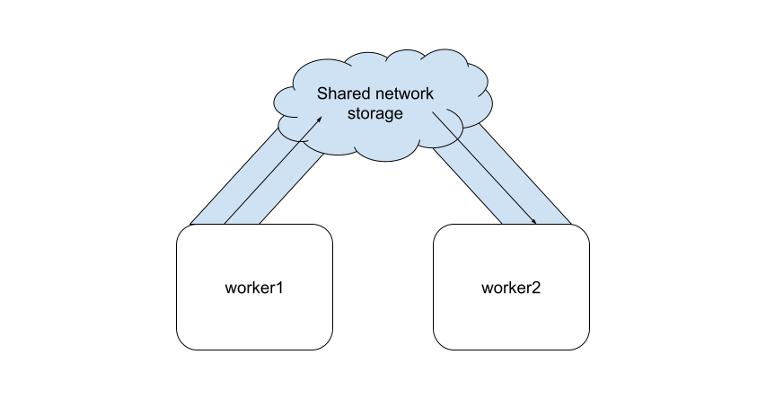

# Cloud Computing Final Proposal
James Ryan, advised by Prof. Rob Marano

A demo video can be found [here](https://youtu.be/-2rc3Oy66FU).

## Course Goals

Our course goals involve creating an MVP which follows our four design goals:

1. Make Resources Easily Accessible
2. Mask the fact that these resources are distributed over a network
3. Build each component to be easily interchangable
4. Have the ability to scale based on usage

My solution provides a working demo of a container being migrated between two
worker virtual machines. These workers could be anything, eg: some kind of
machine in a datacenter designed to run time-shared customer containers. With a
little expansion. These are "workers".

Briefly, each worker has access to a shared network pool, where each can write
to and communicate with eachother. The final design uses this shared pool to
migrate containers + their state to other machines, allowing for seamless
downtime if a worker needs to undergo maintenance. All of this has been designed
modularly using Infrastructure-as-Code, where each worker is defined
idempotently using Ansible scripts. We simulate a networked environment using
Vagrant.



## Technical challenges while working on the project

Docker completely does not support saving checkpoint states to files/folders.
See [this Moby issue](https://github.com/moby/moby/issues/37344)

There appears to be a lack of support for checkpointing among some
distributions. I initially selected Ubuntu 24.04 LTS as my base OS, but for each
of the vagrant containers themselves, the `crun` binary had no support for
checkpointing at all, so I would have had to compile it myself.

## Prerequisites to run

This demo has only been tested on Ubuntu 24.04 LTS and Fedora 40 Workstation.

The Worker containers must run Fedora Linux.

Vagrant must be installed, you can find the instructions
[here.](https://developer.hashicorp.com/vagrant/install)

Ansible should be installed as well, follow the instructions
[here.](https://docs.ansible.com/ansible/latest/installation_guide/index.html)

## Steps to run

Pull down the repo and save it in a safe place
```
$ cd ~
$ git clone https://github.com/secureshellprotocol/ece465.git
$ cd ece465/provisioning
$ ./configure.sh
$ vagrant up --provision
```

Configuration should take around 10 minutes.

Each machine should be available over ssh, eg: `vagrant ssh worker1`

## Future work

Some future work would being able to remotely tell a machine to launch an image
after another machine informs it that it had pulled down an image. Currently, as
seen in the demo video, it must be done with human interaction.

One possible solution would be a daemon which watches for directory updates: eg,
each machine has its own semaphore associated with itself, and its own directory
where it can find container image tars + container state tars from other
machines. To migrate from a source to a destination machine, the source machine
would run `./checkpoint.sh` and save to a well-defined spot which both machines
agree on being the tar destination. Then, the source machine sets a semaphore
which the destination machine watches. When the destination sees that semaphore
get updated, it checks that well-defined directory, and pulls the image + ram
state, using the `./restore.sh` script. I do not have enough time left in the
semester to implement this.

## Scripts 

### Reseting the Vagrant Environment

To destroy our worker VM's, and re-provision them to the intended state:
```
$ vagrant destroy
$ vagrant up --provision
```

### Reseting the endpoint

To restart just the endpoint (eg, for a `Caddyfile` reload), just run
```
./reset_endpoint.sh
```

## Troubleshooting

### Failed to find role 'geerlingguy.docker'

```
ERROR! the role 'geerlingguy.docker' was not found in <directory list>
```

Ensure that you have run the `configure.sh` script in the repo root directory

### The IP Ranges configured for the host-only network is not within the allowed ranges

This means VirtualBox set a different address range than what was expected for
our demo.

A lot of IP's are statically referenced (blegh), so you'll need to go to
`/etc/vbox/networks.conf` on your host machine and adjust to match
```
    * 192.168.56.0/21
```

See [Oracle VirtualBox
Documentation](https://www.virtualbox.org/manual/ch06.html#network_hostonly) on
the issue.

## References:

[Jeff Geerling, "Ansible for DevOps"](https://www.ansiblefordevops.com/)

[S. Nadgowda, S. Suneja, N. Bila and C. Isci, "Voyager: Complete Container State
Migration,"](https://ieeexplore.ieee.org/abstract/document/7980161)

[George Washington University's Distributed Systems website.](https://gwdistsys20.github.io/project/#milestone-1-select-a-topic)


